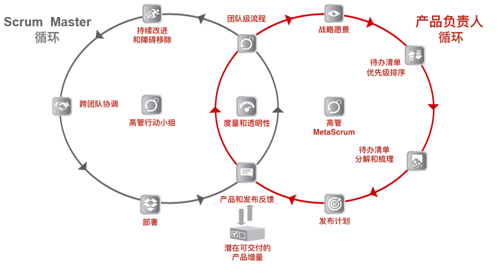
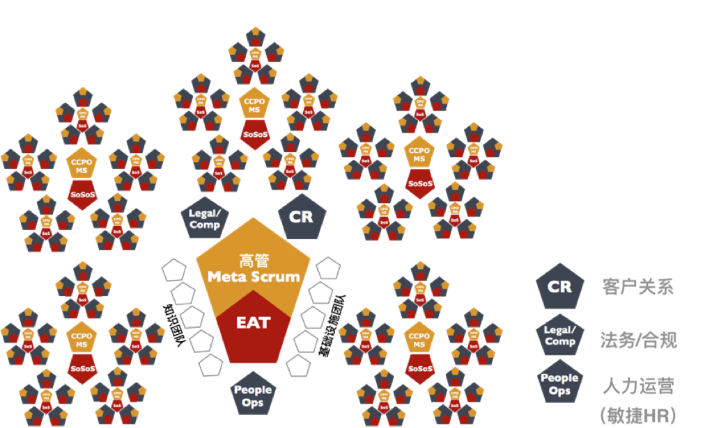

Scrum At Scale® 指南
-------------------

版权所有© 2006-2018 Jeff Sutherland 及 Scrum Inc. 

Scrum@Scale是Scrum Inc.的注册商标。本指南基于"署名-相同方式共享许可协议4.0"发布。(CC BY-SA 4.0)

简体中文版原创翻译团队：申健 Jacky Shen (CST, CTC, Agile Coach); 
王洪亮 Stephen Wang (CSP, Agile Coach); 李国彪 Bill Li (CST, Agile Coach);

简体中文版授权译文链接：<http://www.uperform.cn/scrum-at-scale-guide-chinese/>，欢迎转载，请保留所有版权信息并遵循共享许可协议进行演绎。

# Scrum@Scale指南之目的

最初在Scrum指南中描述的Scrum，是单个团队进行开发、交付和持续发展复杂产品的框架。自诞生以来，它已经扩展到需要多个团队合作来创建产品、处理过程、服务和系统。创建Scrum@Scale是为了有效地整合这种新型的团队生态系统，从而优化组织的整体策略。为了实现这个目标，它利用一个自由扩展的架构建立起一个“最小可行的官僚机构”，自然地将单个Scrum团队的功能扩展到整个组织中。

本指南包括构成Scrum@Scale框架的组件定义，包括扩展的角色、扩展的事件、企业级工件，以及将它们组织在一起的各种规则。

Jeff Sutherland博士基于Scrum、复杂自适应系统理论、博弈论、面向对象技术等背后的基础原则开发了Scrum@Scale。本指南采纳了许多有经验的Scrum实践者的输入，基于他们的现场工作成果。本指南之目标是读者能够自行实施Scrum@Scale。

## 为什么要Scrum@Scale?

Scrum是为单个团队而设计，使其能够在可持续的速率下发挥最佳生产力。在该领域中，人们发现随着组织内的Scrum团队数量增长，最佳输出（可工作的产品）及那些团队的速率会开始下降（比如由于跨团队依赖和重复劳动等问题）。很明显，为了获得线性的可扩展性，人们需要一个有效整合那些团队的框架。设计Scrum@Scale是为了利用自由扩展的架构达成这个目标。

通过使用无标度架构，组织的增长并不受限于以一组武断规则所决定的特定方式；相反，它可以有机地基于自己的独特需求而增长，并维持可持续的变革速度，从而可以被组织的成员们接受。

Scrum@Scale是为组织的整体扩展而设计：所有部门、产品和服务。它可以被运用到不同领域，包括工商业、政府或学术界中的各类组织。

## Scrum@Scale的定义

Scrum（名词）：Scrum是一个框架，在此框架中，人们可以解决复杂自适应问题，同时高效并创造性地交付最大价值的产品。

Scrum指南是最小功能的集合，它通过彻底的透明性促进检视和适应性，从而驱动创新、绩效和团队幸福感。

Scrum@Scale（名词）：Scrum@Scale是一个框架，在此框架中，一致采用Scrum指南进行运作的Scrum团队网络可以解决复杂自适应问题，同时高效并创造性地交付最大价值的产品。

**注意：** 这些“产品”可以是硬件、软件、复杂的集成系统、处理过程、服务等，取决于Scrum团队所处的领域。

Scrum@Scale是:
* 轻量的 - 最小可行的官僚机构
* 易于理解的 - 仅仅包含Scrum团队们
* 难以精通的 - 需要实施一个全新的运作模型

Scrum@Scale是一个对Scrum进行扩展的框架。通过使用Scrum来扩展Scrum，它彻底简化了规模扩展。它仅仅包含一些Scrum团队，这些团队通过Scrum of Scrums和MetaScrums进行整合。

Scrum@Scale本身基于组件的性质允许组织定制他们的转型策略和实现方式。它使得他们获得一种能力，可以将转型的努力聚焦在他们认为最有价值或最需要改变的领域内，然后再向其他方面取得进展。

在Scrum中，要注意区分对“What”与“How”的问责。在Scrum@Scale中也是一样，那么就要明确地理解权限和职责，从而消除浪费性的组织冲突，令团队更容易达致最佳生产力。

为了区分这两个权限，Scrum@Scale包含两个回路：Scrum Master回路（“How”）和产品负责人回路（“What”），彼此具有两个相互接触点。总之，这些回路造就了一个强大的框架，整合多个团队朝着同一个方向而努力。

## Scrum@Scale框架的组件

## 价值观驱动的文化

除了区分对“What”与“How”的问责，Scrum@Scale还进一步在实证背景下创造价值驱动的文化，旨在建立健康的组织。Scrum的价值观包括：开放、勇气、专注、尊重和承诺。这些价值观驱动着实验性决策，而其取决于透明、检视和调整这三大支柱。

开放支持着所有工作和过程的透明性，没有这种透明度，就无法诚实地检视并试图更好地调整它们。勇气指的是大胆跳跃，这是以创新方式更快地交付价值所需要的。

专注和承诺是我们处理工作职责的方式，把交付客户价值作为最高优先级。最后，所有这一切都必须发生在一个尊重每个人的工作环境中，否则不可能创造任何东西。

Scrum@Scale支持仆人式领导风格和基于意图的领导力模型，以帮助组织蓬勃发展，[^1]培养一个以可持续速率进行工作的积极环境，致力于将面向客户价值放在努力的第一位。

## 开始使用Scrum@Scale

在实施大型团队网络时，针对少量团队开发出一个可扩展的参考模型是至关重要的。当部署多个团队时，Scrum实施中的任何缺陷都会被放大。

因此，第一个挑战就是建立少量良好实施Scrum的团队。这组团队克服了那些阻碍敏捷性的组织问题，并为Scrum创建一个在组织中众所周知可运行的参考模型，将其用作整个组织范围内扩展Scrum的模式。

随着团队参考模型的加速，延迟交付、产生浪费或妨碍业务敏捷性的障碍及瓶颈会变得明显。消除这些问题的最有效方法是在整个组织中传播Scrum，以便优化整个价值流。

Scrum@Scale通过使组织浸泡在Scrum中，并有机地分配速度和质量，从而实现了生产力的线性扩展，与组织的特定策略、产品和服务保持一致。

# Scrum Master回路

## 团队级过程

在Scrum指南中明确阐述了**团队级过程**。它由三个工件、五个事件和三个角色组成。团队级过程旨在：

* 最大限度地使完成和通过质量验证的工作流动起来。
* 每个Sprint都提高一点点速率。
* 以一种可持续和丰富的方式运作。

## 整合如何做事(“How”) - Scrum of Scrums

需要协作的多个团队组成一个**“Scrum of Scrums”（SoS）** 。SoS是“团队之团队”[^2]，每天举行一个**规模化每日例会（SDS）**事件，每个团队派代表参加（通常是团队的Scrum Master，尽管任何人都可以参加，也可以派多个人参加）。SDS的存在是为了协调团队并移除障碍以交付价值。

SDS事件反映了每日Scrum例会，优化了团队网络的协作和绩效。另外，SDS：

* 少于15分钟的时间盒。
* 每个团队必须派代表参加。
* 是一个团队代表们解决3个简单问题的论坛：
	* 我的团队有什么障碍阻止了他们完成他们的Sprint目标（或影响即将发布的版本）？
	* 我的团队是否在做任何事情阻止了其他团队完成他们的Sprint目标（或影响他们即将发布的版本）？
	* 我们发现了团队之间的任何新的依赖关系吗，或者找到了解决现有依赖关系的方法吗？

这一组Scrum Master们本身就是一个Scrum团队，负责在每个Sprint末尾从所有参与团队那里完全地集成出一个潜在可交付的产品增量。SoS团队需要实时地应对所有参与团队所提出的障碍。

SoS充当一个发布团队，必须能够直接地向客户交付价值。为了能有效地做到这一点，它需要与Scrum指南保持一致；也就是说，要有自己的角色，工件和事件。这包括一个待办清单梳理事件，他们在其中决定哪些障碍已经“准备好”被移除，最佳移除障碍的方式是怎样的，团队如何才能知道它是“完成”的。要特别关注SoS回顾事件，团队代表们在其中分享各自团队中的任何成功的学习收获或流程改进，以便在SoS中的各个团队能够将这些实践标准化下来。

为了在每个Sprint结束时交付一个完全集成的潜在可交付产品，它需要具备所需的所有技能。它具有产品负责人代表来解决优先级问题。它可能需要经验丰富的架构师，QA负责人和其他操作技能组。当启动Scrum@Scale时，团队们可能还不具备能够支持持续部署的基础架构。这会迫使SoS建立一个“集成团队”或“发布团队”，以完成克服工程缺陷所需的额外工作。SoS被鼓励去激进地解决集成和部署的障碍，因为它创造了一个超高生产力的环境，例如，亚马逊有3300个Scrum团队，平均每秒部署超过一次[^3]。

## Scrum of Scrums Master (SoSM)

SoSM负责联合团队的发布，并且必须：

* 使组织可以看到障碍待办清单。
* 移除团队自己无法解决的障碍。
* 对障碍进行排序，特别要关注跨团队依赖和产品待办清单的分配。
* 提升Scrum of Scrums的效果。
* 与产品负责人们密切合作，每个Sprint部署至少一个潜在可交付的产品增量。
* 利用产品负责人的发布计划来整合多团队的部署工作。

## 扩展SoS

根据组织或实施的规模，可能需要多个SoS来交付非常复杂的产品。在那些情况下，可以从多个Scrum的Scrum中创建一个**Scrum of Scrum of Scrums（SoSoS)**。 SoSoS是Scrum团队的一个有机模式，可以无限扩展。每个SoSoS都应该有SoSoSM角色们，以及每个工件和事件的扩展版本。

扩展SoS减少了组织内部的沟通路径数量，因此复杂性被封装了起来。SoSoS与SoS的接口、SoS与单个Scrum团队的接口，两者都采用了相同的方式，从而实现线性可扩展性。

示例图：

**注意：** 尽管Scrum指南将最优团队规模定义为3到9人，但哈佛大学的研究认为最优团队规模为4.6人。[^4] 针对高绩效Scrum团队的研究一再表明4或5人在一起工作是最优人数。对于SoS中的团队数量，这种模式带来的线性可扩展性是至关重要的。因此，在上图和下图中，选择了五边形来表示一个5人团队。这些图仅仅是示例，您的组织图表可能会有很大差异。

## 高管行动小组

针对整个敏捷组织的Scrum of Scrums被称为高管行动小组（EAT）。EAT是SoS不能移除的那些障碍的终点站。所以，它必须由在政治和财务上得到充分授权的人们组成，去移除那些障碍。EAT的职能是协调多个SoS（或者SoSoS）。和任何Scrum团队一样，它也需要具备一个PO和SM。EAT最好也像Scrum团队一样可以每天见面。每个Sprint他们必须至少见一次面，并且具备一个透明的待办清单。

例图展示了1个EAT，正在协调分布在5个群组中的25个团队

## EAT的待办清单及责任

Scrum是一个区别于传统项目管理的敏捷操作系统。整个SM组织汇报给EAT，后者负责在组织内建立、维护和提升其打造的敏捷操作系统。EAT的角色是创建组织转型待办清单（一份经过排序的列表，包含待完成的敏捷举措）并确保落地执行。例如，如果在一个旧组织中存在一个传统的产品开发生命周期，那么一个新的敏捷产品开发生命周期需要被创建、实现和支持。通常它会比旧方法的更好地支持质量和合规事项，但是需要采纳一套不同的规则和指南来实施。另外，组织发展和治理的很多方面也需要调优。

EAT对于整个组织的Scrum质量负责。它的职责包括但不仅于：

* 为参考模型创建敏捷操作系统，以扩展到整个组织，包括提升敏捷性的企业运营规则，过程和指南。
* 度量和改进组织内的Scrum质量
* 构建组织内业务敏捷的能力
* 创建一个针对Scrum专业人士的持续学习中心
* 支持去探索新型工作方法

最后，EAT必须比照SoS，聚集PO群体来建立和支持相应的的产品负责人组织，从而扩展PO职能。这些PO和关键干系人的团队被称为**MetaScrum**。

## Scrum Master组织的输出/效果

SM组织（SoS、SoSoS和EAT）作为一个整体来完成Scrum Master回路的组件：**持续改进和移除障碍，跨团队协调，和部署**

持续改进和移除障碍的目标是：

* 识别障碍并转化为机遇。
* 维护一个安全的和结构化的环境以排序和移除障碍，并验证和落实改进。
* 确保组织内的可见性以促成变革。

跨团队协调的目标是：

* 协调多个关联团队间的相似流程。
* 管理跨团队依赖以确保它们不会变成障碍。
* 使团队规范和指南的保持对齐，以确保持续的输出。

SoS的目标是像个发布团队一样工作，因此产品部署也是其分内事，而决定发布内容则是PO的分内事。因此，部署的目标是：

* 持续流动式地向客户交付有价值的完成产品。
* 将不同团队的工作集成到一个无缝的产品。
* 确保用户体验的高质量。

# 产品负责人回路

## 整合做什么事(“What”) - MetaScrum

如果一组产品负责人有必要整合一个唯一的待办清单，以供Scrum of Scrums来工作，那么他们自己就形成一个团队称为**MetaScrum**。每个SoS都有一个对应的MetaScrum。MetaScrum沿着同一路径来对齐多个团队的优先级，这样他们就可以整合多个待办清单，并和干系人保持一致以得到他们对待办清单的支持。MetaScrum举行一种规模化的待办清单梳理活动。

* 每个产品负责人（或其代理）都必须参加
* 这个事件是领导者、干系人或其他客户表达各自倾向的论坛

这个事件按需发生，每个Sprint至少发生一次，以确保一个“就绪”的待办清单。MetaScrum的主要职能是：

* 创建产品的主要愿景并且使之对整个组织可见。
* 和干系人保持一致以确保他们支持产品待办清单的实现。
* 创建唯一的排序的待办清单；确保规避了重复工作。
* 针对SoS内所有团队创建统一的“完成的定义”。
* 消除由SoS提出的依赖。
* 生成一份整合的发布计划。
* 监控能够洞察产品的度量，并基于其进行决策。

类似于SoS，多个MetaScrum本身也作为Scrum团队来运作。所以，需要某人来扮演SM来保持团队的正常沟通。他们还需要唯一的人来负责协调，使得MetaScrum覆盖的所有团队创建出唯一的产品待办清单。这个人被指定为**产品总负责人**。

## 产品总负责人(CPO)

通过MetaScrum，产品总负责人与各个团队的产品负责人来协调优先级。他们以干系人以及顾客需求来对齐待办事项的优先级。类似于SoSM，可以是某个团队的PO来扮演这个角色，或者是某个人全职担任这个角色。他们的主要职责和普通PO是一样的，但是在扩展的时候：

* 建立整个产品的战略愿景
* 创建唯一的、排序的待办清单，包含将要被所有团队交付的价值。
* 这些事项对于一个团队的PO来说可以是更大规模的故事。
* 与相应的SoSM紧密工作在一起，以便有效地部署MetaScrum团队创建的发布计划。
* 监控客户对产品的反馈并相应地调整待办清单。

## 扩展MetaScrum？

如同SoS可以增长到SoSoS，MetaScrum也可以用同样的机制进行扩展。没有专门的术语对应这些扩展单元，他们的CPO们也没有专门的扩展头衔。我们鼓励每个组织发展自己的方式。下图中，我们选择了再增加一个“总”以突出那些PO。

一些例图：

**注意：** 如上所述，这些多边形代表着理想规模的Scrum团队和MetaScrum。这些图仅仅作为例子，你的组织图可能会显著不同。

## 高管MetaScrum（EMS）

MetaScrum使得PO及其对应的SoS能够以一种网状设计进行无限地扩展。整个敏捷组织的MetaScrum是高管MetaScrum。EMS拥有组织的愿景并设立整个公司的战略优先级，使各个团队围绕共同目标来对齐。

例图展示了1个EMS，正在协调分为5个组的25个团队：

## 产品负责人组织的输出/效果

PO组织(各种MetaScrum，CPO和高管MetaScrum)作为整体来工作以满足产品负责人回路的组件：**战略愿景、待办清单优先级排序、待办清单分解和梳理，以及发布计划**

设置战略愿景的目标是：

* 透过一个共享的路径清晰地对齐整个组织。
* 清晰而有力地表述组织为什么存在。
* 描述组织会做什么从而调度其关键资产以支持其使命。
* 持续更新以响应快速变化的市场情况。

待办清单优先级排序的目标是：

* 针对待交付的产品、功能和服务，识别出一个清晰的排序。
* 待办清单的排序反映了价值创造、风险缓解和内部依赖。
* 在分解和梳理待办清单之前，先在整个敏捷组织内对高层举措进行排序。

待办清单分解和梳理的目标是：

* 把复杂项目和产品分解为独立的可工作元素，每个元素都可以被一个团队在一个Sprint中完成。
* 捕获和提炼涌现的需求和客户反馈。
* 确保所有的待办事项条目是真的“准备就绪”以便被各个团队拉取。

发布计划的目标是：

* 预报关键特性和能力的交付
* 向干系人沟通交付预期
* 按需更新优先级排序

## 理解反馈

**反馈**组件是PO和SM回路交叉的第二个点。产品反馈通过调整产品待办清单来驱动持续改进，发布反馈通过调整部署机制来驱动持续改进。获取和分析反馈的目标是：

* 验证我们的假设。
* 理解顾客如何使用产品和与产品互动。
* 捕获新特性和新功能的创意。
* 定义针对已有功能的改进。
* 朝着产品/项目完成的方向更新进度，以更好地规划发布计划并与干系人对齐。
* 识别出部署方法和机制的改进项。

## 度量与透明性

彻底的透明性是Scrum最佳状态运作的本质，但是只在能够拥抱Scrum价值观的组织中可行。它使组织能够诚实地评估进度并检视和调整其产品及过程。这是Scrum指南中记载的Scrum的实证主义本性的基石。

SM和PO回路各自需要的度量会分别由SM和PO组织来决策。对于两个特定组织以及那些组织中的特定功能来说，度量也可能是唯一的。Scrum@Scale并不要求任何特定的度量集，但是它推荐了最低配置，即组织应该度量如下方面:

* 生产力 —— 例如，每个Sprint交付的可工作产品的总量变化
* 价值交付 —— 例如，单位团队工作量能够带来的业务价值
* 质量 —— 例如，缺陷率或者服务宕机时间
* 可持续性 —— 例如，团队满意度

设置这些度量指标以及透明性是为了：

* 提供适当的上下文给所有的决策者——包括团队成员在内——以做出优秀的决策。
* 尽量缩短反馈周期以避免矫枉过正。
* 最小化地要求团队、干系人和领导者进行额外投入。

## 关于组织设计的一些说明

Scrum@Scale自由扩展的本性，允许将组织设计为一个个组件，就像框架本身一样。它允许重新平衡和重构团队，从而响应市场。随着组织的增长，分布式团队带来的益处可能也很重要。一些组织在无法获取人才的时候则通过外包开发来扩展和签约。Scrum@Scale展示了如何扩展这种情况，同时避免过长的延迟时间、妥协的沟通以及低劣的质量，使得组织在规模上和地理分布上兼具线性扩展性。[^5]

在这个组织图中，**知识和基础设施团队**表示一些虚拟的专业团队，这些专家的数量太少，难以保证在每个团队中都配备。他们作为一个组与多个Scrum团队进行整合，遵照服务水平协议，每个专业方面请求都流经同一个PO，他将那些请求转换为透明的已排序的待办清单。值得注意的是，这些团队并不是坐在一起的一群各自为政的个体(这是为什么他们被标记为中空多边形)；这些团队成员都坐在实际的Scrum团队当中，但是他们组成这个虚拟Scrum是为了传播待办清单和过程改进。

**客户关系，法务/合规、人力资源及运作**也包含在这里，因为他们是组织中必要的部分，他们将独立于Scrum团队而存在，其他人将依赖于他们。

关于EAT和EMS的最后一点：在这个图中，由于有2个成员同时存在于这两个团队中，所以两者看起来是重叠了。在非常小的组织或者实施中，EAT和EMS可以由同一批人组成。

## 结束语

Scrum@Scale是为了扩展生产力而设计的，使得整个组织在一个显著改善的工作环境中能够高质量地做到事半功倍。在大型组织中适当的应用本框架可以削减产品和服务的成本，并且提升质量和创新。

Scrum@Scale是为了让Scrum浸透组织而设计的。所有团队，包括了领导层、人力资源、法务、咨询和培训，以及产品和服务团队，他们在精简和提升组织的时候都采用同一种Scrum风格。

良好实施的Scrum可以运作起整个组织。

## 致谢

我们感谢IDX创建了Scrum of Scrums，它允许Scrum扩展到上百个团队，[^6]感谢PatientKeeper创建了MetaScrum，[^7]它使得创新产品能快速部署，感谢OpenView Venture Partners将Scrum扩展到整个组织。[^8] 我们珍视来自英特尔的二万五千多人实施Scrum的输入，教会了我们——“没有事物能扩展”——除了一个自由扩展的架构，还要感谢具有最大的Scrum团队的SAP产品组织，教会了我们让2000多个Scrum团队一起工作的必要因素就是让管理层参与到MetaScrum中。

敏捷教练和培训师们与Jeff Sutherland一起工作，在亚马逊、GE、3M、丰田、Spotify和很多其他公司实施了这些概念，这对于在更广范围的不同领域的公司中验证这些概念是非常有帮助的。

最后，Avi Schneier和Alex Sutherland制定和编辑本文的工作是价值无量的。

[^1]: Marquet, L David, Turn the Ship Around!: How to Create Leadership at Every Level, Greenleaf Book Group, 2012
[^2]: McChrystal, General Stanley and Collins, Tantum and Silverman, David and Fussell, Chris, Team of teams: New rules of engagement for a complex world, Penguin, 2015
[^3]: Monica, R. (2018). Personal Communication: Amazon Scrum Implementation. J. Sutherland. Seattle, Amazon.
[^4]: Hackman, J Richard, Leading teams: Setting the stage for great performances, Harvard Business Press, 2002
[^5]: Sutherland, Jeff and Schoonheim, Guido and Rustenburg, Eelco and Rijk, Maurits, “Fully distributed scrum: The secret sauce for hyperproductive offshored development teams”, AGILE’08. Conference, IEEE: 339-344, 2008
[^6]: Sutherland, Jeff, “Inventing and Reinventing SCRUM in five Companies”, Sur le site officiel de l’alliance agile, 2001
[^7]: Sutherland, Jeff, “Future of scrum: Parallel pipelining of sprints in complex projects”, Proceedings of the Agile Development Conference, IEEE Computer Society 90-102, 2005.
[^8]: Sutherland, Jeff and Altman, Igor, “Take no prisoners: How a venture capital group does scrum”, Agile Conference, 2009. AGILE’09, IEEE 350-355. 2009
